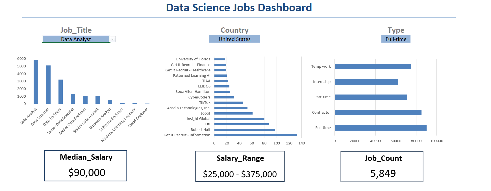
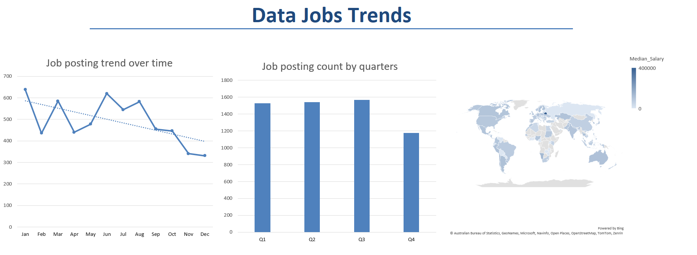

# Excel Data Jobs Dashboard

This project is an interactive Excel dashboard that analyzes data science job postings.

## What this project shows
- Distribution of data-related job roles
- Salary ranges and median salaries
- Job trends over time and by quarter

## Key features
- Interactive slicers (Job Title, Country, Job Type)
- Executive overview with KPIs
- Trends and insights page

## Tools used
- Microsoft Excel
- Excel Functions & Formulas
- Manual Filtering and Data Organization

## Dashboard preview

### Executive Overview

### Trends & Insights

